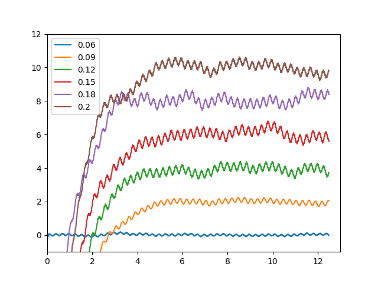

# Project Document

## Project Topic

Simulation of Echoplex Tape Transport

## Description

Tape echoes work by recording sound on a magnetic tape, and playing back. The tape speed or distance between heads determine the delay, and a feedback variable allows for a repetitive effect. In our project, we simulate the effect of tape delay.

## Echo Player System
The main system flow of the echoplex is like below:

The final gui looks like this, we can use `TurnOn` and `TurnOff` to turn on the echoplex system or just output the input. And we can use `Volumn` to set the output volumn, `Sustain` to set the devaying degree of each echo and `delay` to determine the controlled delay.

## Delay System
And in order to completely simulate the real-word delay time, we use 3 parts to constrcut `Delay` function. The first part is basic contrled delay which set by user. The second part is sinusoid change which is introduced by capstan and pinch wheel(2 components of Echo Tape). And the third part is white gaussian noise which is caused by tensioner(componenet of Echo Tape) friction. The delay system is like below:

### Control Delay

To eliminate the effect of sudden change when reset new contrled delay, we use leaky integrator(*tracking filter*) to interpolate the previous delay with new delay.

$d_c(n)$ is delay time at time n, $d_\tau$ is target delay time, $\tau$ is a constant.

$$d_c(n) = (1-\lambda)d_\tau + \lambda d_c(n-1)$$

where:
$$\lambda = exp(\frac{-1}{\tau f_s})$$

From picture in testing program, we set intial delay time as 0.06s, and then change delay time to 0.12 s at time 5 and change delay time to 0.12s at time 10. We can see at each shift, the delay time gradully change instead of suddenly change.

### Sinusoid Delay

From frequency analysis of real echoplex, we know that the magnitude of 22Hz and 3.5 Hz is great which is caused by periodical distortion of pinch wheel and capstan. So we can combine 2 sinusoid generator to this part.

$$d_s(n) = 0.001(sin(\frac{2\pi *22 * n}{f_s}) + sin(\frac{2\pi *3.5* n}{f_s}))$$

And combine contrled delay and sinusoid delay, we can have below delay time:

### White Gaussian Noise

The easiest way to apply low-pass-filter to white-Gaussian-noise is to let several consecutive points share the same noise. So instead of generate a white noise every point, we generate a noise every $50$ points. After combine 3 parts of delay, we can have our combined delay system:

To better see the slight change of delay, we use substrct-mean figure(Some offset between each delay line is for display convenience).

### Low Pass Filter

The output in combined delay systems doens' seem messy, and we have to apply a LPF to it. Here we use running sum with the length equal to delay time on combined ouput to realize the LPF.

In the end, we have our final delay time which looks like below:

## Optimization

### Running Sum

To do running sum directly is computationally expensive, so we rewrite a class to implement it in $O(1)$ complexity. We use a circular buffer to store each data and 2 pointers to record next to substract and next to add up. And when we change controlled delay time, we relocate the next to subtract pointer to satisfy the new controlled delay time. The details of sunning sum is shown in `runningsum.py`.

### Block Processing

When apply our version-1 echoplex to wav file with 40000 sample rate and 2 channels, there's a severe strech of the original sound in real-time processing. So we try to eliminate it with block-processing to decrease writing and reading file times. And we update plot every block instead of every sample point which improve the performance of program greatly.
 
## Usage
Use command `python echo_player.py` to create the effect of echoplex on a specific.

Use command `python echo_player_mic.py` to create the effect of echoplex on real-time microphone input.